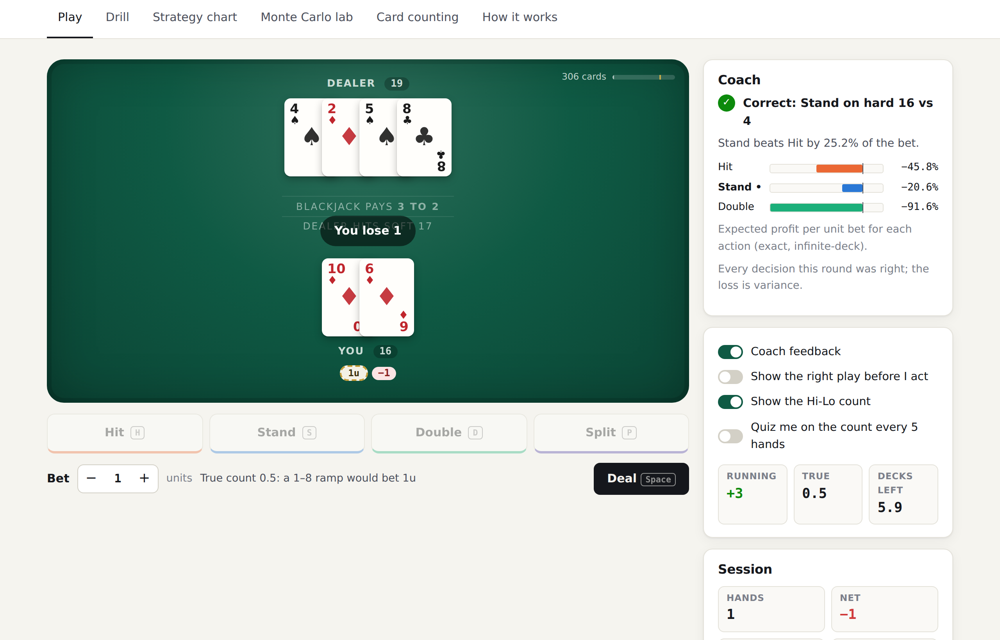
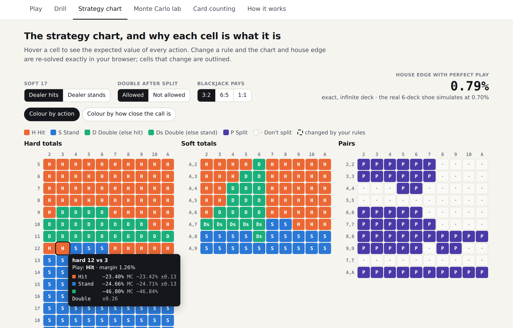
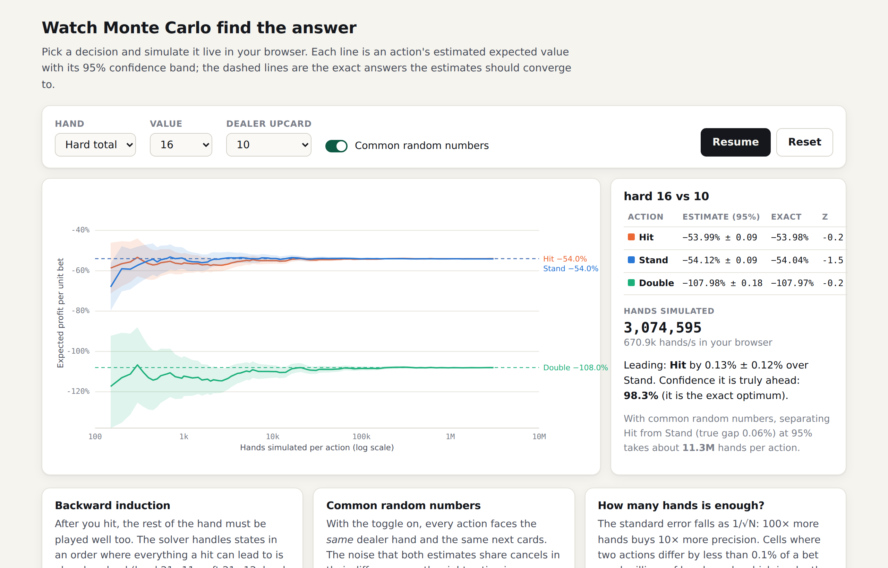
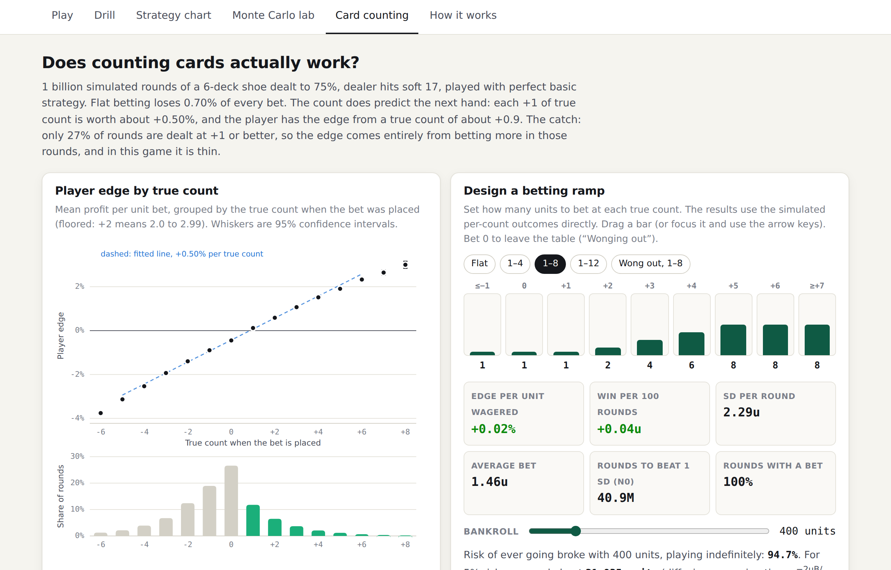

# Beat the Dealer

**Blackjack basic strategy derived by Monte Carlo simulation, checked cell by cell against an exact solver, and a Hi-Lo card-counting study over one billion simulated rounds. The results come with an interactive site where you can play, drill and run the simulations yourself.**

**▶ Live demo: [claudialbombin.github.io/beat-the-dealer](https://claudialbombin.github.io/beat-the-dealer/)**

[](https://github.com/claudialbombin/beat-the-dealer/actions/workflows/ci.yml)


[](LICENSE)



## What it shows

| | Result |
|---|---|
| House edge with perfect basic strategy (6 decks, dealer hits soft 17) | **0.696% ± 0.007%** (95% CI, 10⁹ simulated rounds) |
| Monte Carlo chart vs the exact solver | **380 / 380** decisions agree |
| Player edge gained per +1 Hi-Lo true count | **+0.50%** |
| True count where the player gains the edge | **≈ +0.9** |
| Counter's edge with a 1–12 bet spread / leaving at negative counts (1–8) | **+0.19%** / **+0.80%** |

The honest conclusion: **card counting works, but in this game the edge is thin.** The count predicts the next hand very reliably, but only about a quarter of rounds are dealt at a positive count. With basic strategy alone a 1–8 spread roughly breaks even; beating the game takes a wider spread or leaving the table when the count goes negative.

## The site

| | |
|---|---|
| **Play** | A full table: 6-deck shoe with a cut card, splits, doubles, dealer peek. A coach grades every decision against basic strategy and shows the expected-value cost of mistakes. Optional running and true count, count quizzes, and table rules you can change. Keyboard: `H` `S` `D` `P`, `Space` to deal. |
| **Drill** | Rapid two-card decisions dealt at their real frequencies, with filters for hard, soft, pairs, close calls or your own mistakes, and a mastery map of the chart. |
| **Strategy chart** | Hover any cell for the EV of every action (exact, plus the Monte Carlo estimate with its confidence interval). Change a rule (S17, no DAS, 6:5) and the whole game is re-solved in the browser; changed cells are outlined. Colour by "how close is the call". |
| **Monte Carlo lab** | Pick any decision and simulate it live in a Web Worker. You can watch the estimates and their 95% bands converge on the exact answer, and turn common random numbers on and off to see the variance reduction. |
| **Card counting** | EV by true count from the billion-round run, a drag-to-edit betting ramp with edge, variance, N0 and risk of ruin, 200 simulated bankroll paths, and a speed-count drill. |

<p>


</p>



## How it works

```
python/  Monte Carlo solver ──► web/data/strategy.{json,csv} ──► C/ shoe simulator ──► web/data/counting.json
           │    ▲                                                                            │
           ▼    │ checked against                                                           ▼
        exact solver (infinite-deck recursion)                                   web/ (static site)
```

### 1. Basic strategy by Monte Carlo ([`solver.py`](python/src/blackjack/solver.py))

For every decision (player total, soft or hard, dealer upcard) and every legal action, simulate the rest of the hand N = 2,000,000 times and average the profit. Two details make this a correct solver rather than a heuristic:

- **Backward induction.** After a hit, the rest of the hand has to be played optimally too. States are solved in an order where everything a hit can lead to is already solved (hard 21→11, soft 21→12, hard 10→4), and each simulation continues with the policy estimated so far.
- **Common random numbers.** Every action for a given upcard is evaluated against the *same* simulated dealer hands, and the actions of one state share the same player cards. The difference between two actions then reflects the decision, not sampling luck. The paired standard error of that difference is reported for every cell.

The whole solver is vectorised with NumPy (one state-action is a handful of array operations over N hands) and parallelised across upcards. With 2M hands per action it runs in about two minutes.

### 2. The exact reference ([`exact.py`](python/src/blackjack/exact.py))

With an infinite deck every draw is independent, so the game can be solved exactly by recursion over a few hundred states. The Monte Carlo solver uses the same card model so its estimates can be compared one-to-one:

- all 380 chart cells agree;
- the estimates are unbiased (a test checks the distribution of z-scores against the exact EVs);
- the Monte Carlo chart's exact EV equals the optimum's (−0.789%).

Three cells (11 vs A, 16 vs 10, soft 15 vs 4) are statistical ties at 2M hands, because the two best actions differ by less than 1.96 standard errors. The exact solver confirms the Monte Carlo pick in each.

The exact solver itself is checked against the standard dealer bust probabilities and the published 6-deck H17 DAS chart. It matches every cell except soft 13 vs 5, a known card-removal effect: doubling is right in a 6-deck shoe, hitting with an infinite deck.

### 3. The real game, a billion times ([`C/`](C/src/round.c))

A C11 port of the Python engine plays the finite 6-deck shoe (75% penetration, the round in progress always finishes at the cut card) with the solved strategy and a Hi-Lo count. It runs about 5M rounds/s per thread with independent xoshiro256** streams per thread. The hole card is counted only when it is turned over, as a real counter would see it. It writes per-true-count moments and outcome histograms. A Python test runs both implementations and checks they agree within sampling error.

### 4. The site ([`web/`](web/))

Plain ES modules with no framework and no build step. The exact solver is ported to JavaScript (checked against the Python values to 10⁻⁶) so rule changes re-solve instantly. The Monte Carlo lab runs in a Web Worker, and the charts are a small hand-written SVG layer.

## Rules

6 decks · dealer hits soft 17 · blackjack pays 3:2 · double on any two cards · double after split · one split per hand, split Aces receive one card · dealer peeks for blackjack · no surrender · no insurance · 75% penetration.

## Run it

```bash
# Python: solver, exact reference, reference simulator (numpy only)
cd python
pip install -e ".[dev]"
pytest -q                                   # 43 tests, ~10 s
python -m blackjack chart                   # print the exact chart
python -m blackjack solve --n 2000000       # Monte Carlo chart -> web/data/strategy.{json,csv}

# C: the billion-round counting simulation
cd ../C
make test                                   # unit tests
./bin/bjsim --rounds 1000000000 --threads 8 --out ../results/counting_c.csv
cd ../python && python -m blackjack count --from-c ../results/counting_c.csv --write

# Web: static, serve the folder
cd ../web
npm test                                    # engine, exact solver and MC worker tests
python3 -m http.server 8000                 # open http://localhost:8000
```

The committed data (`web/data/`, `results/`) comes from exactly these commands: seed 2026, 2M hands per action for the chart and 10⁹ rounds for counting.

## Repository layout

```
python/src/blackjack/   cards, rules, engine (finite shoe), exact.py, solver.py, counting.py, cli.py
python/tests/           rules edge cases, solver validation, C cross-check
C/                      bjsim: include/bj.h, src/{rng,cards,strategy,round,main}.c, tests/
web/                    index.html, css/, js/ (engine, exact, charts, views/, mc-worker.js), data/, tests/
results/                raw output of the C run
.github/workflows/      CI (C, Python, JS tests) and GitHub Pages deployment
```

## Limitations

- **Basic strategy only.** The counter never deviates from the chart. Count-based index plays (the "Illustrious 18") are worth roughly another 0.1–0.2%.
- **Infinite-deck strategy.** The chart and the coach's EV figures use the infinite-deck model. The shoe simulation is exact for 6 decks.
- **Rules not modelled:** surrender, re-splitting and insurance.
- **Bankroll paths are a teaching tool.** They draw rounds independently from the simulated (true count, outcome) distribution, which ignores how counts persist within a shoe. Risk of ruin uses the standard diffusion approximation.

This is an educational project about simulation and decision-making under uncertainty, not gambling advice.

## References

- E. O. Thorp, *Beat the Dealer* (1962): the first computer-derived basic strategy and card-counting system.
- P. A. Griffin, *The Theory of Blackjack*: card-removal effects and counting-system analysis.
- D. Schlesinger, *Blackjack Attack*: risk of ruin, N0 and betting ramps.
- P. Glasserman, *Monte Carlo Methods in Financial Engineering*: variance reduction with common random numbers.

## License

[MIT](LICENSE) © Claudia María López Bombín
